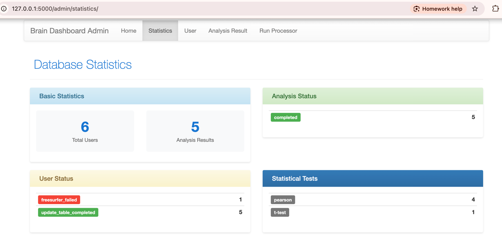

Usage — Brain Dashboard
=======================

This document explains how to use the Brain Dashboard application: the Admin interface (manage data and run FreeSurfer) and the Main application (perform statistical analyses).

Overview
--------
- Admin interface: Flask app for managing raw data, user features, and triggering FreeSurfer processing.
- Main application: Dash app for filtering users, selecting variables, running analyses, and visualizing results.

Admin interface (Flask)
-----------------------
**Access**: Default: http://localhost:5000/admin/ (use PORT_ADMIN from your .env)

Primary pages and flows
~~~~~~~~~~~~~~~~~~~~~~~
- **Statistics:** Shows summary statistics of users in the database and the analyses.

- **Users:**

    - Lists raw data files discovered, processing status, and (optional) user features.

    - Status lifecycle: preprocessed -> processing -> processed -> failed/succeeded

    .. image:: _static/screenshot_admin_users.png
          :alt: screenshot_admin_users
          :width: 400px
          :align: center

- **Run Processor:**

    - Presents a more detailed users list with their featuers.

    - Updates the database with new users that are added to the `$RAW_DATA` folder (**Update DB** button).

    - Runs FreeSurfer processing for selected raw files (**Run Freesurfer** button).

    - Updates the FreeSurfer-derived volumes table after processing completes (**Update Freesurfer Table** button).

   .. image:: _static/screenshot_admin_run_processor.png
        :alt: screenshot_admin_run_processor
        :width: 600px
        :align: center

- **Analysis Results:** List of previous analyses with status and links to text files with the results of the analysis.

   .. image:: _static/screenshot_admin_analysis_results.png
        :alt: screenshot_admin_run_processor
        :width: 600px
        :align: center

Typical Admin workflow:
~~~~~~~~~~~~~~~~~~~~~~~
1. **Update new raw data:** When a raw data file is added to the raw-data folder (DATA_DIR), it needs to be automatically detected and inserted into the DB with status "preprocessed" by watch_folder.py (run in the background, see in :doc:`running`). If it is not updated, you can click "Update DB" to run it manually.

2. **Run Freesurfer analysis:** Select a user in preprocessing status and run FreeSurfer by clicking on the `Run Freesurfer` button.
   This is equivalent to running the freesurfer.py script as follows:

    .. code-block:: bash

        $PROJECT_ROOT/brain-dashboard-venv/bin/python -m brain_dashboard.scripts.freesurfer --file-name RAW_FILE_NAME --recon-all

    where RAW_FILE_NAME is the name of the raw file (e.g., 20211117_101656T1wMPRAGERLs003a1001.nii).

3. **Update volumes table:** After processing, update the FreeSurfer volumes table with the results by clicking the `Update Freesurfer Table` button. This can also be done by running the script:

    .. code-block:: bash

        $PROJECT_ROOT/brain-dashboard-venv/bin/python -m brain_dashboard.scripts.freesurfer --file-name RAW_FILE_NAME --update-table

    where RAW_FILE_NAME is the name of the raw file (e.g., 20211117_101656T1wMPRAGERLs003a1001.nii).

4. **Update the features of the user:** Update the `$PROJECT_ROOT/config/users_features.csv` file with the featuers of the user (e.g., age, gender, etc.).

    Example CSV (users_features.csv):

    .. code-block:: csv

        file_name,age,gender,score,education_years
        20211117_101656T1wMPRAGERLs003a1001.nii,20,male,50.0,8
        30211117_101656T1wMPRAGERLs003a1001.nii,25,female,57.5,9

    where the first column is the file name of the raw data file, and the other columns are the features of the user.

    After refreshing the page, the features appear in the Users table.

5. Repeat steps 1-4 as needed for all new raw data files.

Main application (Dash)
-----------------------

Filter and select users, choose variables and groups for statistical comparisons, run analyses, and view results.

The statistical analyses supported include t-tests, ANOVA, and regression. The analysis takes place on a per-region basis using FreeSurfer-derived volumes on one of the features as the dependent variable.

**Access**: Default: http://localhost:5006/ (use PORT_APP from your .env)

   .. image:: _static/screenshot_main_screen.png
      :alt: screenshot_main_screen
      :width: 600px
      :align: center

Typical Admin workflow:
~~~~~~~~~~~~~~~~~~~~~~~

1. **Give analysis name**: Enter a name for the analysis in the "Analysis name" field.

   .. image:: _static/screenshot_give_name.png
      :alt: screenshot_give_name
      :width: 300px
      :align: center

2. **Select users**: Filter and select users from the database using the filter panel.

   .. image:: _static/screenshot_select_users.png
      :alt: screenshot_select_users
      :width: 400px
      :align: center

3. **Choose features and test**: Select the dependent variable (e.g., age, score), and test type (t-test, ANOVA, regression). For t-test and ANOVA, select the grouping variable.

   .. image:: _static/screenshot_select_features_test.png
      :alt: screenshot_select_features_test
      :width: 400px
      :align: center

4. **Run analysis**: Click "Run analysis" to start the statistical test.

5. **View results**: After the analysis completes, view results in the brain display and data plot panels:

    - The statuses of the analyses are: `v`: success, `x`: failed, `>`: running

    - Select an analysis from the analysis history list to load results.

    .. image:: _static/screenshot_select_results.png
        :alt: screenshot_select_results
        :width: 400px
        :align: center

    - Brain display: View regional p-values / t-values on the brain display, with or without multiple-comparisons correction (FDR).

    - Data plot: View per-region plots comparing groups in the data plot panel.

    .. image:: _static/screenshot_show_results.png
        :alt: screenshot_show_results
        :width: 400px
        :align: center

The brain display allows you to select different types of visualizations:

- **3D-Interactive**: Shows the cortical surface in 3D, rotate, zoom, and click on regions to see values.

    .. image:: _static/screenshot_3d_interactive.png
        :alt: screenshot_3d_interactive
        :width: 400px
        :align: center

- **Surface view**: Shows a projection of the cortical surface in 2D.

    .. image:: _static/screenshot_surface_view.png
        :alt: screenshot_surface_view
        :width: 400px
        :align: center

- **Glass brain**: Shows 3D subcortical structures in a glass brain view.

    .. image:: _static/screenshot_glass_view.png
        :alt: screenshot_glass_view
        :width: 400px
        :align: center

- **2D glass brain**: Shows a projection of subcortical structures in 2D.

    .. image:: _static/screenshot_2d_glass_view.png
        :alt: screenshot_2d_glass_view
        :width: 400px
        :align: center

In the data plot panel, select a region from the brain display to see the corresponding data plot.

    .. image:: _static/screenshot_data_plot.png
        :alt: screenshot_data_plot
        :width: 400px
        :align: center
